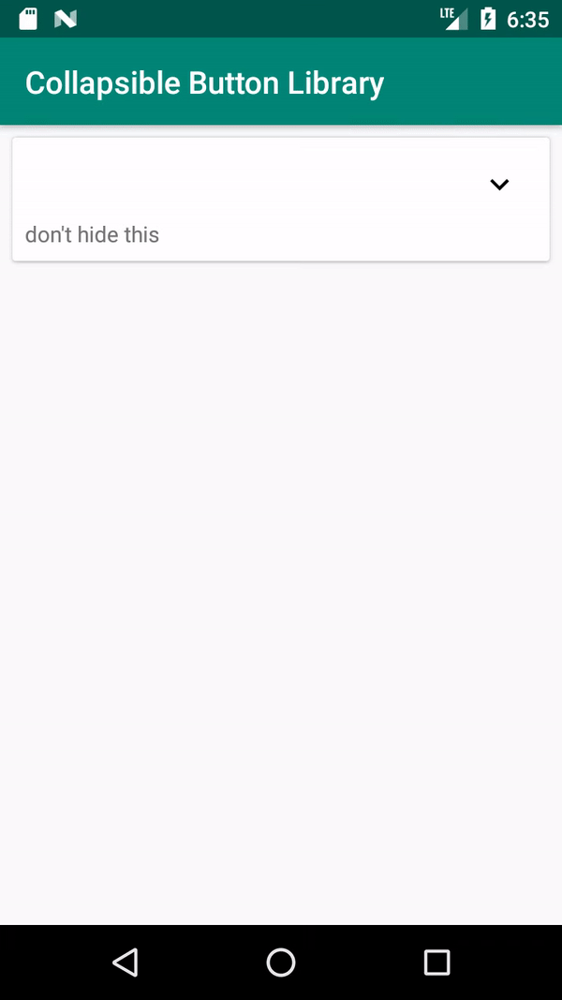

# Collapsible Button
Very basic collapsible button



## Installation
Gradle
```groovy
dependencies {
    implementation 'com.github.rmitsubayashi.collapsiblebutton:1.0.0'
}
```

## Usage
```xml
<ViewGroup android:animateLayoutChanges="true">
    <com.github.rmitsubayashi.collapsiblebutton.CollapsibleButton
            android:layout_height="wrap_content"
            android:layout_width="wrap_content"
    />
</ViewGroup>
```
*Make sure to set ```animateLayoutChanges``` to ```true``` in the parent layout.


## Customization
| Attribute     | Format   | Description                                    |
| ------------- | -------- | ---------------------------------------------- |
| targetView    | id       | the view to collapse                           |
| expanded      | boolean  | whether the target view is expanded or not     |
| toExpandSrc   | drawable | the icon shown when the target view is hidden  |
| toCollapseSrc | drawable | the icon shown when the target view is visible |

## License
This project is licensed under the terms of the MIT license.